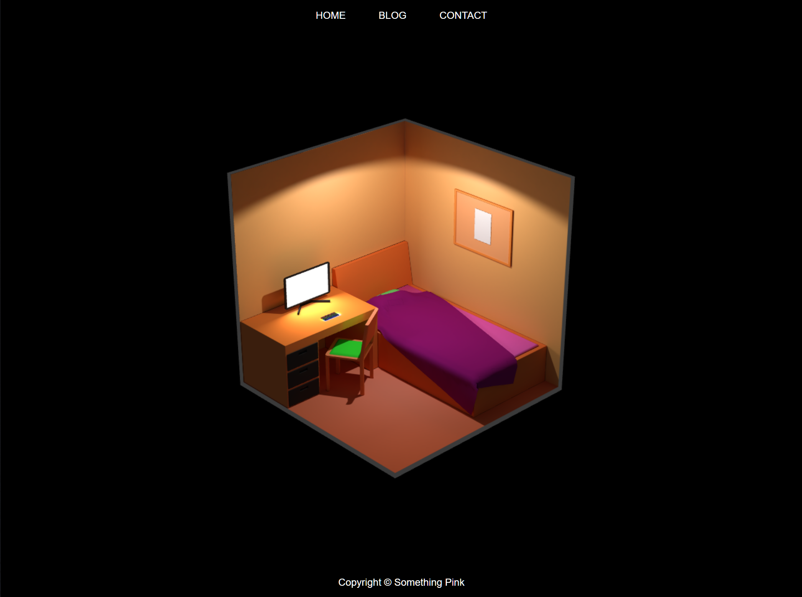

# Sample 3D website

This is a sample project on creating a 3D website with BabylonJS.

## 3D model

The 3D model is included in the [blender](blender) folder.

## Running it

You will need NodeJS in order to run this project. Execute the following command for your development server:

    npm run serve

## Known issues

The following points will need to be addressed before you can take your 3D website into production:

- Responsive design is missing, no mobile menu included.
- The model needs to be optimized so the final GLB file is ~10-15 MB maximum for speedy loading.
- Window resizing doesn't resize the viewport.
- No 404 error handling.
- The Draco loader should be added to the webroot for GDPR compliance.

## License

This project is licensed under the MIT license. You can freely use it as a starting point for your projects, but you need to credit "Something Pink" somewhere on your website, preferably with a link to https://something.pink/.
